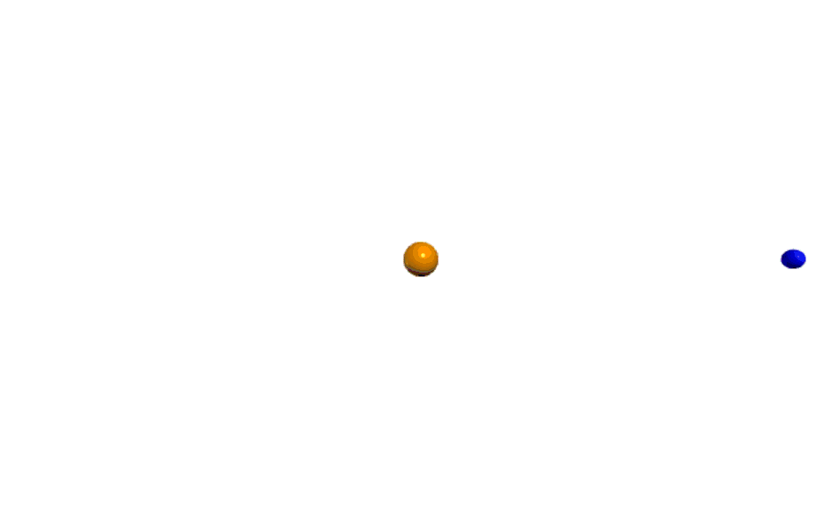
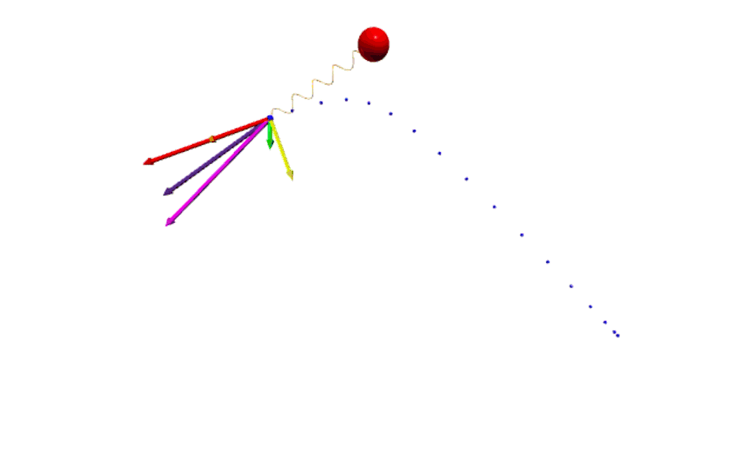

# Physics Lab Simulations & Analysis  

This repository contains a collection of physics lab simulations written by Tyrese and Liam back in 2022, developed with **VPython**, and organized to **Jupyter Notebooks (.ipynb)**.

Each lab includes:  
- Problem statement and background  
- Explanation of physics principles  
- VPython simulations  
- Graphs and analysis of results  
- Conclusions  

# A Glimpse of What Will be Covered 
* *What would happen if the Earth were to have the same mass as the Sun?*

* *What are the forces at work on a ball attached to a fixed object via a spring?*

* *What is the effect of air resistance on a free-falling coffee filter?*

* *What would happen if two objects with equal mass and a spring between them were to collide?*


## 📂 Repository Structure  
```bash
├── labs/            # Contains visuals, observations, and analysis
│ ├── Lab-1.ipynb
│ ├── Lab-2.ipynb
│ ├── Lab-3.ipynb
│ └── ...
├── assets/
│ ├── gifs/          # Looping simulation GIFs for quick preview
│ └── images/        # Graph diagrams of physical properties
└── README.md        # (You're here 👋)
```


## 🧑‍💻 Running the Simulations

All simulations and their corresponding output can be found via [GlowScript](https://www.glowscript.org/), a platform that we used to write and host the simulations listed in this repository. No account is needed to view the simulation nor is there a requirement to download any packages.

The links for each lab are listed below:
1. [Lab #1](https://www.glowscript.org/#/user/Tyrese_G/folder/Physics-Labs/program/Lab-1)
2. Lab #2
    - [Lab #2.1](https://www.glowscript.org/#/user/Tyrese_G/folder/Physics-Labs/program/Lab-2-1)
    - [Lab #2.2](https://www.glowscript.org/#/user/Tyrese_G/folder/Physics-Labs/program/Lab-2-2)
    - [Lab #2.3](https://www.glowscript.org/#/user/Tyrese_G/folder/Physics-Labs/program/Lab-2-3)
    - [Lab #2.4](https://www.glowscript.org/#/user/Tyrese_G/folder/Physics-Labs/program/Lab-2-4) 
3. N/A
4. [Lab #4](https://www.glowscript.org/#/user/Tyrese_G/folder/Physics-Labs/program/Lab-4)
5. [Lab #5](https://www.glowscript.org/#/user/Tyrese_G/folder/Physics-Labs/program/Lab-5)
6. [Lab #6](https://www.glowscript.org/#/user/Tyrese_G/folder/Physics-Labs/program/Lab-6)
7. [Lab #7](https://www.glowscript.org/#/user/Tyrese_G/folder/Physics-Labs/program/Lab-7)
8. [Lab #8](https://www.glowscript.org/#/user/Tyrese_G/folder/Physics-Labs/program/Lab-8)
9. Lab #9
    - [Lab #9.1](https://www.glowscript.org/#/user/Tyrese_G/folder/Physics-Labs/program/Lab-9-1)
    - [Lab #9.2](https://www.glowscript.org/#/user/Tyrese_G/folder/Physics-Labs/program/Lab-9-2)
10. [Lab #10](https://www.glowscript.org/#/user/Tyrese_G/folder/Physics-Labs/program/Lab-10)

Note that you can also find a "*Want to Run it Yourself*" section with a link at the bottom of every lab report.
